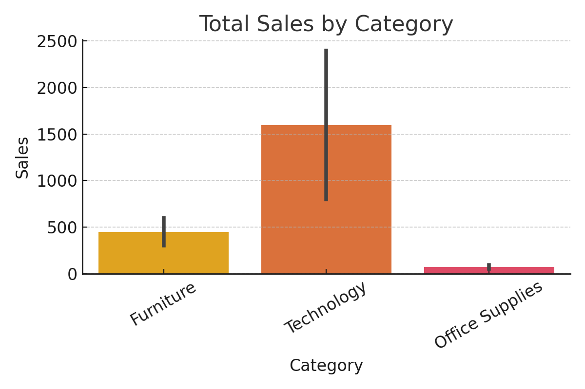

## 📊 Projects

### [Sales Data Analysis](./sales-data-analysis/)
Exploratory analysis and visual insights from a retail sales dataset using Python and Jupyter Notebook.

- Tools: Pandas, Matplotlib, Seaborn
- Key Insight: Furniture sales peak in Q4, suggesting seasonal trends
- 
