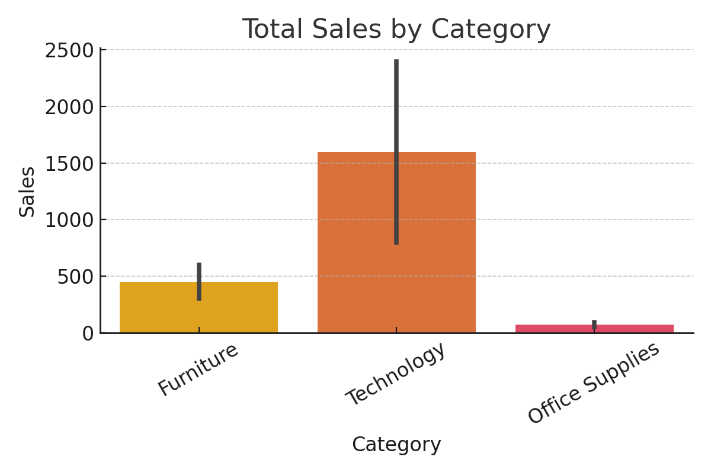

# 📊 Sales Data Analysis

This project explores retail sales data to uncover patterns in sales performance, customer segments, and seasonal trends.

## 📁 Structure
- `data/`: Raw sales data CSV
- `notebooks/`: Jupyter notebook with analysis
- `visuals/`: Plots and saved charts

## 🔧 Tools
Python, Pandas, Matplotlib, Seaborn, Jupyter Notebook

## 📌 Insights
- Top sales category: Furniture
- Most profitable months: November & December
- Regional sales gap between East and Central zones

## 📊 Visuals

## 🚀 Next Steps
- Add dashboard with Tableau or Power BI
- Compare profits vs. discounts
